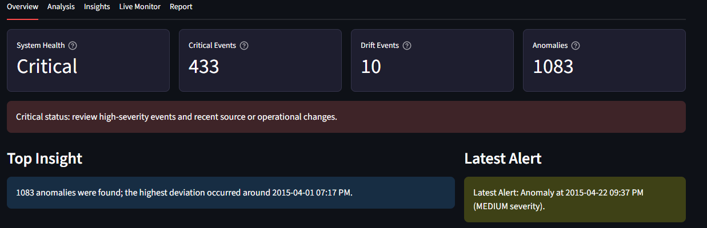
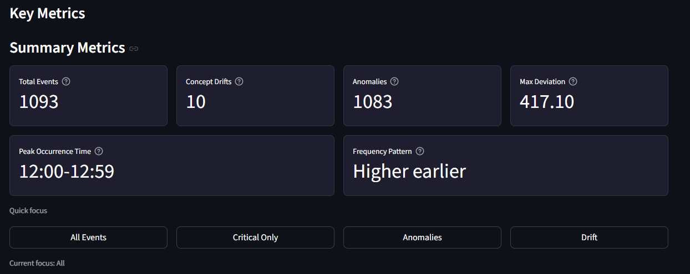
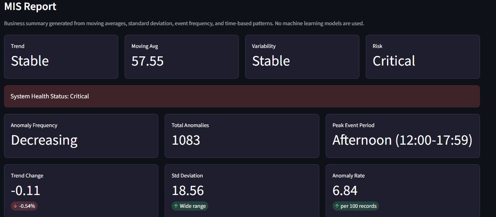
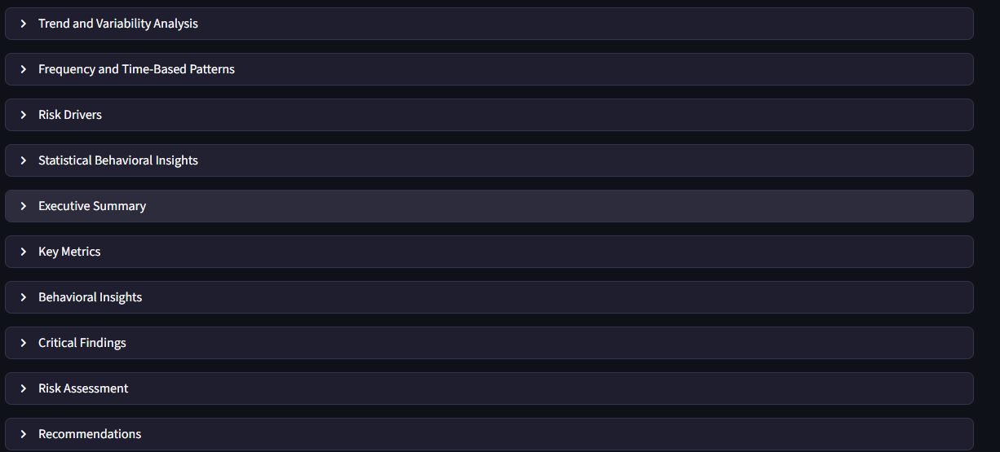
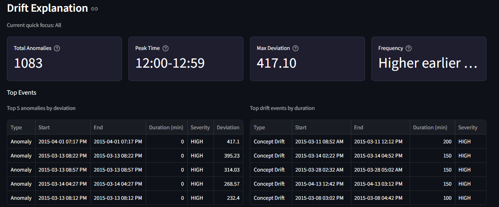

# 🚀 Concept Drift & Anomaly Detection System

## 📌 Overview
This project is a real-time system designed to detect **concept drift** and **anomalies** in streaming time-series data.  
It helps monitor changing data patterns and provides actionable insights through an interactive dashboard.

---

## 🔍 Key Features
- Real-time concept drift detection (sudden & gradual)
- Anomaly detection in time-series data
- Interactive dashboard built with Streamlit
- Modular pipeline (data → processing → detection → visualization)
- Insight generation for decision support

---

## 🛠️ Tech Stack
- Python
- Streamlit
- Pandas, NumPy
- Data Visualization

---

## 🧠 How It Works
1. Input streaming or batch time-series data
2. Apply sliding window analysis
3. Detect drift using statistical methods
4. Identify anomalies
5. Visualize results via dashboard

---

## 📸 Demo










---

## ▶️ Run Locally

```bash
pip install -r "streamlit src/requirements.txt"
streamlit run "streamlit src/app.py"